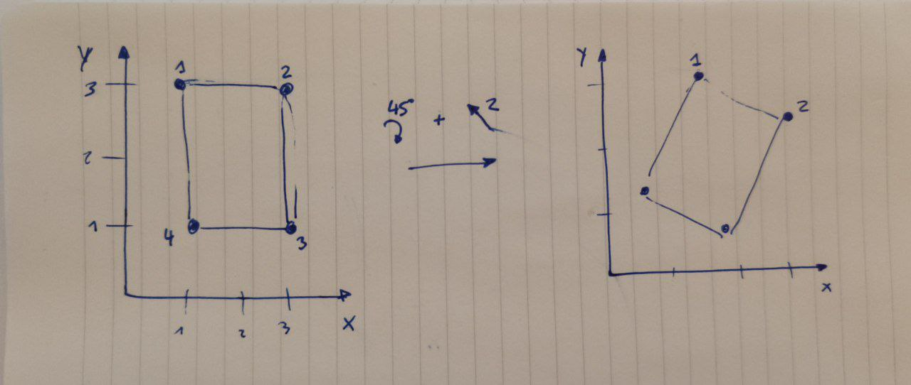

# Coordinates correction

In order to accurately find checkboxes that we know the original coordinates for,
we need to be able to find the transformation that converts them,
using the QR codes and the AMC circles as a reference.

Example of transformation bla bla bla

## Pang functions

### rot

Parameters:
- alpha: angle in degrees

Returns the transformation matrix for the alpha

### trans

Parameters: 
- C1:
- C2:
- initial_guess: default_value 'None'
- method: default value 'SLSQP'

## My functions

Alongside pang's, I implemented my own version of these functions

### get_rotation

Parameters:
- vector: vector [x, y] with the original coordinates
- vector_trans vector [x', y'] with the transformed coordinates

Finds the angle between the vectors, and also the difference in scale

### get_trans

Parameters:
- points: array of vectors [x, y] with a variable number of points, with the original coordinates
- points_trans: array of vectors [x', y'] with the same number of points, with the transformed coordinates

Finds for each point, ([x, y] and [x', y']) the difference in angle and scale.
Then it transforms the original point according to the angle and scale found to [x'', y''],
and looks for the translation between [x'', y''] and [x', y']

## QR coordinates in rotated pdfs

This also works to test whether OpenCV QR detection works in rotated pdfs

### Scanned exam 2

#### Regular version

Transformation between the default coordinates and the scanned coordinates:

| x0     | y0    | alpha | scale |
|--------|-------|-------|-------|
| -58.88 | 32.81 | -0.87 | 0.97  |
| 61.88  | 43.40 | -0.13 | 0.95  |
| -4.78  | 38.56 | -0.28 | 0.96  |

#### Rotated by 45º

Transformation between the default coordinates and the scanned coordinates:

| x0      | y0      | alpha | scale |
|---------|---------|-------|-------|
| 2196.51 | -328.51 | 44.61 | 0.98  |
| 2200.13 | -261.68 | 45.76 | 0.95  |
| 2182.95 | -299.73 | 45.53 | 0.97  |

#### Rotated by 90º

Transformation between the default coordinates and the scanned coordinates:

| x0    | y0      | alpha  | scale |
|-------|---------|--------|-------|
| 32.81 | 2520.88 | -90.87 | 0.97  |
| 42.40 | 2401.11 | -90.13 | 0.95  |
| 38.56 | 2466.78 | -90.28 | 0.96  |

#### Rotated by 180º

Transformation between the default coordinates and the scanned coordinates:

| x0      | y0      | alpha  | scale |
|---------|---------|--------|-------|
| 2492.42 | 3527.22 | 180.00 | 1.01  |
| 2492.42 | 3527.22 | 180.00 | 1.01  |
| 2492.42 | 3527.22 | 180.00 | 1.01  |

## Box coordinates transformation

To get the expected coordinates of the checkboxes,
we need to know the transformation of coordinates between the ones obtained from pyPDF
and the ones from OpenCV.
To do that, we correct an [exam that hasn't been transformed](../multiple_choice_example/filled/filled_33333_fixed.pdf),
and compare the coordinates with the ones generated when compiling the tex file, found in the
[json](../multiple_choice_example/json/question_11111.json).

| box  | x - pyPDF | y - pyPDF | x - OpenCV | y - OpenCV |
|------|-----------|-----------|------------|------------|
| 1    | 105.96    | 383.66    | 383.66     | 517.00     |
| 2    | 105.96    | 367.72    | 367.72     | 517.00     |
| 3    | 105.96    | 324.10    | 324.10     | 517.00     |
| 4    | 105.96    | 308.16    | 308.16     | 517.00     |
| 5    | 105.96    | 265.74    | 265.74     | 517.00     |

With the get_trans function, we get values needed to change

| DPI | x0        | y0        | alpha | scale  |
|-----|-----------|-----------|-------|--------|
| 300 | 1105.5261 | 4604.9818 | 180.0 | 5.5541 |
| 1   | 2.7638    | 11.5124   | 180.0 | 0.0138 |

