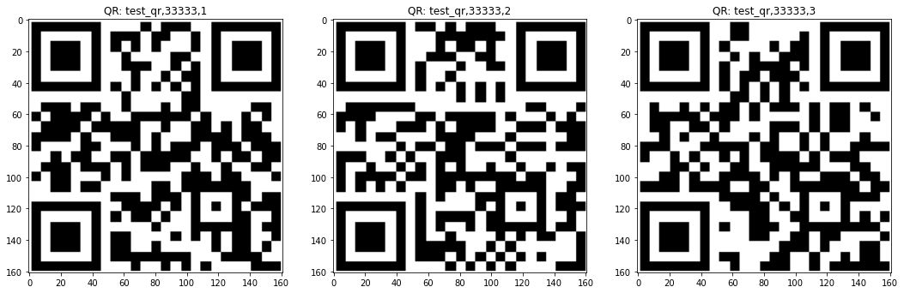
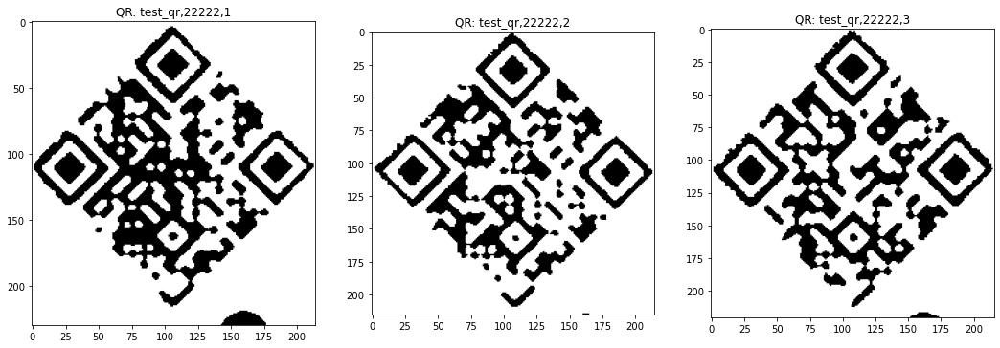

# Coordinates correction

In order to accurately find checkboxes that we know the original coordinates for,
we need to be able to find the transformation that converts them,
using the QR codes and the AMC circles as a reference.

## Pang functions

### rot

Parameters:
- alpha: angle in degrees

Returns the transformation matrix for the alpha

### trans

Parameters: 
- C1:
- C2:
- initial_guess: default_value 'None'
- method: default value 'SLSQP'

## My functions

Alongside pang's, I implemented my own version of these functions

### get_rotation

Parameters:
- vector: vector [x, y] with the original coordinates
- vector_trans vector [x', y'] with the transformed coordinates

Finds the angle between the vectors, and also the difference in scale

### get_trans

Parameters:
- points: array of vectors [x, y] with a variable number of points, with the original coordinates
- points_trans: array of vectors [x', y'] with the same number of points, with the transformed coordinates

Finds for each point, ([x, y] and [x', y']) the difference in angle and scale.
Then it transforms the original point according to the angle and scale found to [x'', y''],
and looks for the translation between [x'', y''] and [x', y']

## QR detection in rotated pdfs

We test whether OpenCV QR detection works in rotated pdfs

### Filled exam 3

Regular version

Transformation between the default coordinates and the filled coordinates:

| x0   | y0   | alpha | scale |
|------|------|-------|-------|
| 0.00 | 0.00 | 0.00  | 1.00  |
| 0.00 | 0.00 | 0.00  | 1.00  |
| 0.00 | 0.00 | 0.00  | 1.00  |

Rotated by 90º

Transformation between the default coordinates and the filled coordinates:

| x0      | y0    | alpha | scale |
|---------|-------|-------|-------|
| 3516.86 | -6.46 | 90.00 | 1.00  |
| 3516.86 | -6.46 | 90.00 | 1.00  |
| 3516.86 | -6.46 | 90.00 | 1.00  |

Rotated by 180º

Transformation between the default coordinates and the filled coordinates:

| x0      | y0      | alpha  | scale |
|---------|---------|--------|-------|
| 2492.42 | 3527.22 | 180.00 | 1.01  |
| 2492.42 | 3527.22 | 180.00 | 1.01  |
| 2492.42 | 3527.22 | 180.00 | 1.01  |

### Scanned exam 2

Regular version

Transformation between the default coordinates and the scanned coordinates:

| x0     | y0    | alpha | scale |
|--------|-------|-------|-------|
| -58.88 | 32.81 | -0.87 | 0.97  |
| 61.88  | 43.40 | -0.13 | 0.95  |
| -4.78  | 38.56 | -0.28 | 0.96  |

Rotated by 45º

Transformation between the default coordinates and the scanned coordinates:

| x0      | y0      | alpha | scale |
|---------|---------|-------|-------|
| 2196.51 | -328.51 | 44.61 | 0.98  |
| 2200.13 | -261.68 | 45.76 | 0.95  |
| 2182.95 | -299.73 | 45.53 | 0.97  |

Rotated by 90º

Transformation between the default coordinates and the scanned coordinates:

| x0    | y0      | alpha  | scale |
|-------|---------|--------|-------|
| 32.81 | 2520.88 | -90.87 | 0.97  |
| 42.40 | 2401.11 | -90.13 | 0.95  |
| 38.56 | 2466.78 | -90.28 | 0.96  |

Rotated by 180º

Transformation between the default coordinates and the scanned coordinates:

| x0      | y0      | alpha  | scale |
|---------|---------|--------|-------|
| 2492.42 | 3527.22 | 180.00 | 1.01  |
| 2492.42 | 3527.22 | 180.00 | 1.01  |
| 2492.42 | 3527.22 | 180.00 | 1.01  |